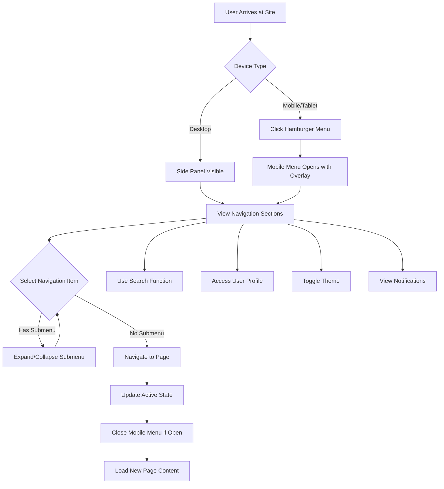
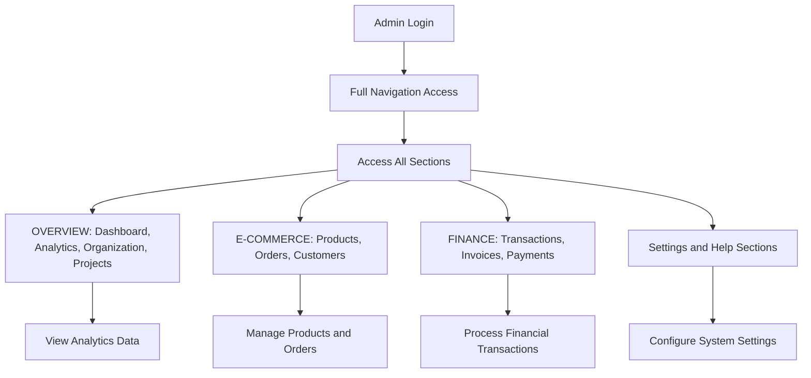

# Side Panel Navigation - Product Requirements Document

## 1. Product Overview

The Side Panel Navigation system transforms ModuLux's current header navigation into a modern, clean side panel interface that matches the visual style and user experience of the reference CMS design. This redesign addresses the current crowded header layout by implementing a sophisticated side panel navigation system with enhanced user experience, improved accessibility, and responsive design.

The new navigation system provides a professional dashboard-like interface that improves content organization, reduces visual clutter, and enhances the overall user experience while maintaining all existing functionality of the current header.

## 2. Core Features

### 2.1 User Roles

| Role | Registration Method | Core Permissions |
|------|---------------------|------------------|
| Website Visitor | No registration required | Can view all public pages and navigate through the side panel |
| Admin User | Backend authentication | Full access to all navigation items, user management, and settings |
| Content Manager | Admin assignment | Access to content-related sections (Products, Projects, Blog) |
| Customer | Contact form submission | Access to customer-specific sections and account information |

### 2.2 Feature Module

The side panel navigation consists of the following main components:

1. **Side Panel Container**: Fixed position navigation panel with collapsible sections
2. **Top Header Bar**: Minimal header with breadcrumb navigation and action buttons
3. **Navigation Sections**: Organized menu items with icons, badges, and expandable submenus
4. **User Profile Section**: Avatar, name, and role display with dropdown functionality
5. **Search Integration**: Built-in search bar with icon and placeholder text
6. **Mobile Menu**: Responsive mobile menu with overlay and smooth animations

### 2.3 Page Details

| Page Component | Module Name | Feature description |
|---------------|-------------|---------------------|
| Side Panel Container | Panel Structure | Fixed position container with white background, subtle borders, and professional styling. Width of 256px with smooth slide animations. |
| Side Panel Container | Responsive Behavior | Collapses on mobile devices (<768px) with hamburger menu trigger. Expands with overlay on mobile, always visible on desktop. |
| Navigation Sections | Section Headers | Uppercase section titles (OVERVIEW, E-COMMERCE, FINANCE) with muted gray color and proper spacing. |
| Navigation Sections | Menu Items | Individual navigation items with icons, text labels, optional badges, and expandable chevrons for submenus. |
| Navigation Sections | Active States | Blue background highlight with blue right border for active pages. Smooth hover effects with light gray background. |
| Navigation Sections | Badges | Small circular badges with white text on blue background showing notification counts (3, 12, 5, 2). |
| Navigation Sections | Submenus | Expandable submenus with chevron rotation animation and indented child items. |
| Top Header Bar | Breadcrumb Navigation | "Dashboard / CMS" breadcrumb trail with proper spacing and separator styling. |
| Top Header Bar | Action Buttons | Theme toggle (sun icon), notifications (bell with red badge showing 3), and settings (gear icon) buttons. |
| User Profile Section | Avatar Display | Circular avatar with initials "JD" on gray background, user name "John Doe" and role "Administrator". |
| User Profile Section | Dropdown Function | Chevron icon for dropdown menu with hover effects and proper spacing. |
| Search Integration | Search Bar | Rounded input field with search icon, placeholder text "Search...", and focus styling with blue border. |
| Mobile Menu | Hamburger Button | Fixed position hamburger menu button with smooth transitions between hamburger and X states. |
| Mobile Menu | Overlay | Semi-transparent black overlay that appears when mobile menu is open, closes menu on click. |
| Accessibility | Keyboard Navigation | Full keyboard support with Tab navigation, Enter/Space activation, and visible focus indicators. |
| Accessibility | ARIA Labels | Comprehensive ARIA labeling for screen readers including roles, expanded states, and current page indicators. |
| Accessibility | Focus Management | Proper focus rings, skip links, and logical tab order throughout the navigation system. |

## 3. Core Process

### User Navigation Flow

### Admin User Flow

## 4. User Interface Design

### 4.1 Design Style

**Color Scheme:**
- Primary Background: White (#ffffff)
- Secondary Background: Light gray (#f9fafb)
- Active State: Blue (#eff6ff) with blue border (#3b82f6)
- Text Primary: Dark gray (#111827)
- Text Secondary: Medium gray (#6b7280)
- Text Muted: Light gray (#9ca3af)
- Accent Blue: #3b82f6 for badges and active indicators
- Notification Red: #ef4444 for notification badges

**Typography:**
- Font Family: System UI, -apple-system, sans-serif
- Section Headers: 0.75rem, uppercase, font-weight: 600
- Navigation Items: 0.875rem, font-weight: 500
- User Name: 0.875rem, font-weight: 500
- User Role: 0.75rem, regular weight

**Button Style:**
- Rounded corners: 0.5rem (8px)
- Hover effects: Light gray background transition
- Focus indicators: Blue ring with 2px offset
- Active states: Blue background with white text

**Layout Style:**
- Card-based design with consistent spacing
- Fixed position side panel (256px width)
- Responsive mobile-first approach
- Generous padding: 1.5rem (24px) for main sections
- Consistent gaps: 0.75rem (12px) between elements

**Iconography:**
- Lucide React icon library
- Consistent 1rem (16px) sizing for navigation icons
- Line-based design with currentColor support
- Proper spacing between icons and text (0.75rem)

### 4.2 Page Design Overview

| Component | Module Name | UI Elements |
|-----------|-------------|-------------|
| Side Panel | Header Section | Logo with blue square icon, brand text "ModuLux", close button for mobile with smooth hover transitions. |
| Side Panel | Search Section | Rounded input field with search icon left-aligned, placeholder text "Search...", focus state with blue border and subtle shadow. |
| Side Panel | Navigation Sections | Organized sections with uppercase titles, menu items with icons and text, active states with blue background and right border. |
| Side Panel | User Profile | Circular avatar with initials, user name in dark text, role in muted gray text, dropdown chevron with hover effects. |
| Top Header | Breadcrumb Area | "Dashboard / CMS" text with proper spacing, mobile hamburger integration, consistent typography. |
| Top Header | Action Buttons | Theme toggle (sun icon), notifications (bell with red badge), settings (gear icon) with consistent hover states. |
| Mobile Menu | Overlay | Semi-transparent black background (rgba(0,0,0,0.5)), smooth fade animation, click-to-close functionality. |
| Mobile Menu | Menu Button | Fixed position hamburger button with shadow, smooth transitions between states, proper z-index layering. |

### 4.3 Responsiveness

**Desktop-First Design Approach:**
- Base design optimized for desktop viewing
- Side panel always visible on screens ≥768px
- Fixed position with proper content spacing
- Full navigation hierarchy available

**Mobile Adaptations:**
- Collapsible side panel with hamburger menu trigger
- Full-screen overlay menu on mobile devices
- Touch-optimized interactions with proper target sizes (44px minimum)
- Simplified navigation with essential items prioritized

**Tablet Considerations:**
- Consistent with mobile behavior for consistency
- Maintains touch-friendly interactions
- Proper spacing for finger navigation

**Breakpoint Strategy:**
- Mobile: < 768px (collapsible side panel)
- Tablet: 768px - 1024px (same as mobile for consistency)
- Desktop: > 1024px (fixed side panel)

**Touch Interaction Optimization:**
- Large touch targets (minimum 44px × 44px)
- Adequate spacing between interactive elements
- Smooth animations with reduced motion support
- Haptic feedback integration where supported

**Performance Considerations:**
- Optimized animations using CSS transforms
- Debounced resize event handlers
- Lazy loading for navigation sections
- Minimal JavaScript for better performance

## Additional Requirements

### Browser Compatibility
- Chrome 90+, Firefox 88+, Safari 14+, Edge 90+
- CSS Grid and Flexbox support required
- ES6+ JavaScript features
- Intersection Observer API for scroll areas

### Performance Requirements
- Component load time: < 100ms
- Animation frame rate: 60fps minimum
- Bundle size impact: < 30KB gzipped
- Mobile performance: Smooth 60fps animations

### Accessibility Standards
- WCAG 2.1 AA compliance required
- Keyboard navigation support
- Screen reader compatibility
- High contrast mode support
- Reduced motion preferences respected

### SEO Considerations
- Semantic HTML structure
- Proper heading hierarchy
- ARIA labels for dynamic content
- Mobile-friendly navigation
- Fast loading times for better Core Web Vitals

This comprehensive side panel navigation system will transform ModuLux's user interface into a modern, professional dashboard-style navigation that significantly improves user experience while maintaining all existing functionality and enhancing accessibility across all devices.